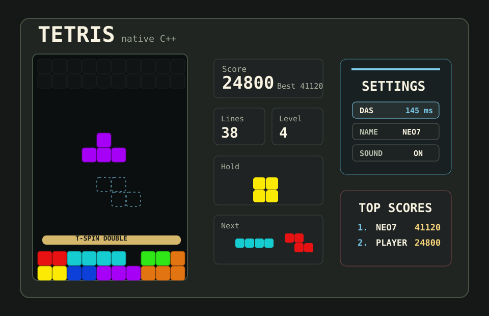

# Native C++ Tetris

A fast, native Windows Tetris built with C++ and the Win32 API. No Raylib, no
engine, no asset pipeline to set up. Just build it and play.

The game has grown from a small practice project into a sharper arcade-style
Tetris with hold, ghost piece, spin clears, combo feedback, persistent best
score, and a dark pixel UI.



## Why It Feels Good

- Hold, ghost landing, and a three-piece next queue for planning ahead
- Short lock delay so grounded pieces can still be nudged into place
- DAS/ARR-style hold-to-move input for smoother left and right slides
- Clockwise and counter-clockwise SRS-style wall kicks for cleaner rotations
- T-spin scoring plus custom L/J/I/S/Z style-spin clears
- Faster line-clear flash, combo, back-to-back, perfect clear, level-up feedback, and best score
- Main menu, pause menu, restart, leaderboard view, and game-over overlays
- Local top-five leaderboard with name entry on qualifying scores
- In-game tuning presets for DAS, ARR, clear effect speed, controls, window scale, and sound
- Pixel-style font with compact Win32 rendering
- Layered sound cues for moves, drops, hold, rotate, clears, spins, level-up, pause, and game over

## Controls

| Key | Action |
| --- | --- |
| Up / Down or W / S in menus | Choose menu item |
| Enter / Space in menus | Select menu item |
| Left / Right or A / D | Move, hold to slide |
| Down or S | Soft drop |
| Up / W / X | Rotate clockwise |
| Z | Rotate counter-clockwise |
| Space | Hard drop |
| C or Shift | Hold |
| P or Esc | Pause |
| F1 | Settings |
| Space while paused | Continue from pause menu |
| R | Restart |
| Q | Quit |

Inside settings, use Up / Down to choose a row, Left / Right to adjust values,
Enter to edit `NAME`, and Esc or F1 to close the panel. `PRESET` switches
between beginner, balanced, fast, and custom handling; `CONTROL` can limit
movement to hybrid, arrows, or WASD; `WINDOW` scales the fixed pixel canvas;
`VOLUME` adjusts the beep cue length. Settings are saved to
`tetris_settings.txt`.
When a game-over score reaches the local leaderboard, type a 3-12 character
name and press Enter, or press Esc to save it under the default player name.

## Scoring

| Action | Points |
| --- | --- |
| Soft drop | 1 per row |
| Hard drop | 2 per row |
| Line clear | 100 / 300 / 500 / 800 |
| T-spin clear | 800 / 1200 / 1600 |
| Style-spin clear | 400 / 700 / 1000 / 1200 |
| Combo bonus | +50 for each clear after the first consecutive clear |
| Back-to-back bonus | +50% of the difficult clear score |
| Perfect clear bonus | 800 / 1200 / 1800 / 3200 |

Level increases every 10 cleared lines. The drop speed ramps up as the level
rises. Best score is saved to `tetris_highscore.txt`, and the local top-five
leaderboard is saved to `tetris_leaderboard.txt`.

## Build And Play

On Windows, open PowerShell in the project folder:

```powershell
.\build.bat
.\main.exe
```

To make a shareable build:

```powershell
.\package.bat
```

That creates `dist\tetris-win-<version>.zip` and
`dist\tetris-win-latest.zip` with the executable, bundled font, docs, README,
and runtime DLLs beside the executable. You only need to rebuild or repackage
after changing the source.

Or build directly with MinGW-w64:

```powershell
g++ -std=c++17 -Wall -Wextra src\*.cpp -mwindows -lgdi32 -luser32 -o main.exe
.\main.exe
```

Or use CMake:

```powershell
cmake -S . -B build
cmake --build build --config Release
.\build\Release\main.exe
```

## Core Tests

The game rules are portable and can be tested without the Win32 window:

```bash
c++ -std=c++17 -Wall -Wextra -Isrc tests/core_tests.cpp src/block.cpp src/blocks.cpp src/game.cpp src/grid.cpp src/high_score.cpp src/leaderboard.cpp src/position.cpp src/settings.cpp src/settings_options.cpp src/sound.cpp -o /tmp/tetris_core_tests
/tmp/tetris_core_tests
```

With CMake:

```bash
cmake -S . -B build
cmake --build build --target tetris_core_tests
ctest --test-dir build
```

## Project Map

```text
src/app_config.h   Window size, file names, timer IDs, font names
src/main.cpp        Win32 window, drawing, input, timers
src/game.cpp        Game rules, scoring, hold, spin detection
src/grid.cpp        Board storage and row clearing
src/high_score.cpp  Best-score file
src/leaderboard.cpp Local top-five leaderboard file
src/settings.cpp    DAS, ARR, effect, and sound settings file
src/settings_options.cpp  Tuning presets and control scheme helpers
src/sound.cpp       Tiny Windows beep cues, no-op elsewhere
tests/core_tests.cpp
```

CI runs the portable core tests on Ubuntu, macOS, and Windows.
